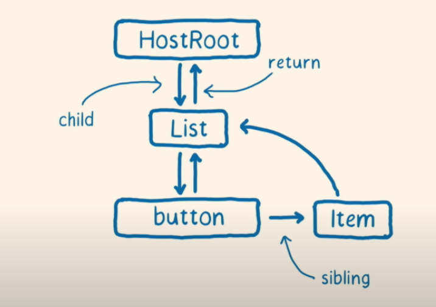
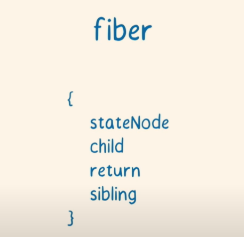
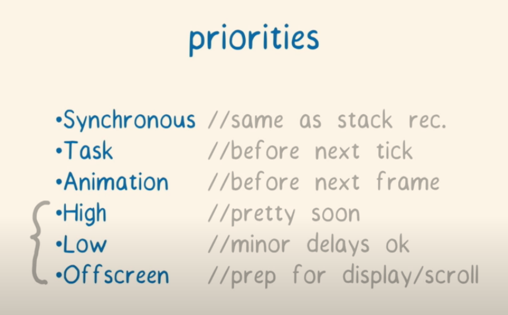
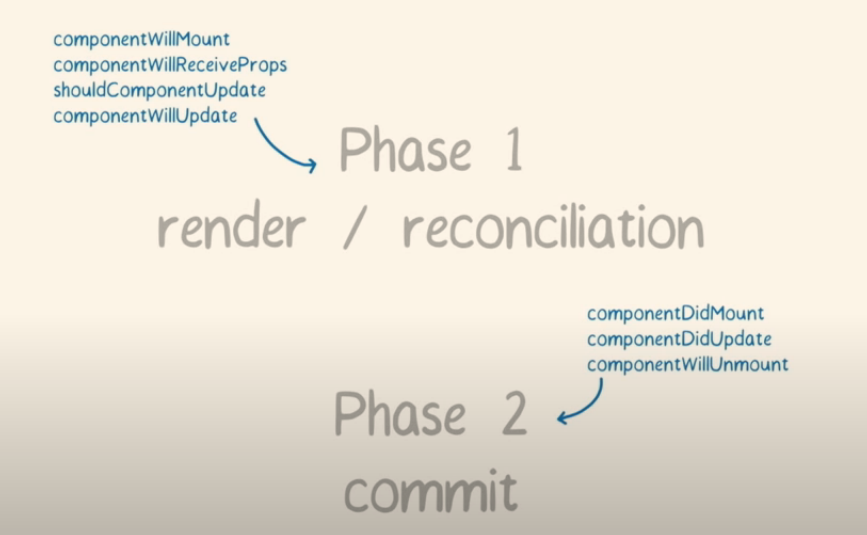
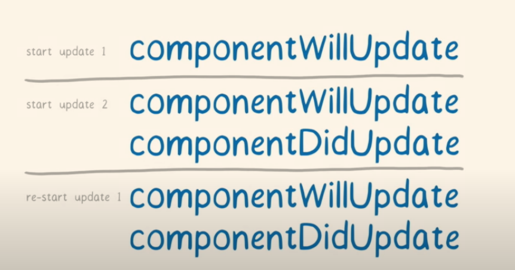

[上一级](../README.md)

# Fiber

旧的调度算法叫 `stack` 调度算法，使用堆栈跟踪任务的执行

`Fiber ` 是新的调度`reconciliation` 算法

 `reconciler` 和 `renderer`

高优先级 `update` ：比如用户的输入

低优先级`update`：比如从接口返回数据，更新 `UI`

`cooperative scheduling`：将任务树分成多个小块，主线程首先执行一块任务，然后再回来执行其他的块任务，通过 `fiber`  的一种数据结构可以知道当前在任务树中的位置。

`fiber`  只是一个普通的`JavaScript` 对象，和 `instance` 有一对一的关系。

例子：

​																												**`fiber tree` **

​																										**`每个 fiber 中包括的信息` **

**`fiber phases`**

 `phase 1` ：`render` /  `reconciliation`     构造 `fiber tree`  `work-in-progress tree`，找出 changes。**阶段一是可以中断的**

`phase 2`：`commit phase`  将 changes 更新到 DOM 上

​				  changes 是需要有优先级的，优先级高的先执行

​					

 

`requestIdleCallback()`

`double buffering`

`starvation`：当高优先级任务一直插队时，低优先级任务可能永远也不会执行

参考：https://www.youtube.com/watch?v=ZCuYPiUIONs