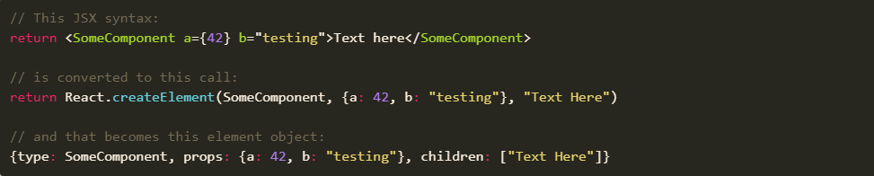

[上一级](../README.md)


# React Rendering 行为

翻译自[Blogged Answers: A (Mostly) Complete Guide to React Rendering Behavior](https://blog.isquaredsoftware.com/2020/05/blogged-answers-a-mostly-complete-guide-to-react-rendering-behavior/)


## 目录


## 什么是 `Rendering`

**`Rendering`** 是基于当前 `props` 和 `state` 组合，要求组件描述它们想要的 `UI` 样子的过程。


### `Rendering` 过程概述

`React` 将从组件树的根开始，向下循环查找所有被标记成 `needing updates` 的组件。对于每个被标记的组件，`React` 会调用`classComponentInstance.render()` （对于 `class` 组件） 或者 `FunctionComponent()` （对于 `function` 组件），并保存输出结果。

组件的 `render` 输出通常使用 `JSX` 语法编写，编译时会被转换成 `React.createElement()`。`createElement` 返回 `js` 对象，用于描述 `UI` 的预期结构。

例子：



在收集了整个组件树的 `render` 输出后，`React` 会比较 `current` 指向的组件树和 `work-in-progress` 指向的组件树，将所有的更新放到一个列表中。这种比较计算的过程叫做 `reconciliation` 。

最后更新 `DOM`。


### `Render` 和 `Commit` 阶段

`react` 团队把整个过程分为两个阶段：

- `Render` 阶段，包括 `render` 组件和计算需要更新部分的所有工作
- `Commit` 阶段，是将这些更新应用到 `DOM`  的过程

`React` 在 `commit` 阶段更新 `DOM` 之后，然后同步执行 `componentDidMount` `componentDidUpdate` 和 `useLayoutEffect`。

`React` 然后设置一个短暂的 `timeout`，超时后，运行所有的 `useEffect` hooks，这一步也被称为 `Passive Effects` （被动 `effects`）阶段。


## `React` 如何处理 `renders` ?

### 排队 `renders`

初始渲染完成之后，有几种不同的方法告诉 `React` 去排队重新渲染：

- class 组件
  - `this.setState()`
  - `this.forceUpdate()`
- function 组件
  - `useState` setters
  - `useReducer` dispatches
- 其他
  - 重新调用 `ReactDOM.render(<App>)` （等同于调用根组件的 `forUpdate()`）


### 标准渲染行为

**当父组件 render 时，React 默认递归 render 父组件里面所有的子组件**

另外，还有一个关键点：

**在普通渲染中，React 并不关心 props 有没有变化，仅仅因为父组件 rendered，子组件将会无条件 render**


例如，假设我们有一个组件树 A > B > C > D，并且已经在页面上显示了它们，用户点击 B 中的一个增加计数器的按钮：

- 调用 B 的 `setState` ，排队 re-render B
- React 从**树的顶部**开始 render
- React 看到 A 没有被标记为需要更新，就跳过 A
- 到 B 时，B 被标记为需要更新，React render B，返回 < C />
- 到 C 时，C 最初没有被标记，但是因为 B rendered 了，C 也要 render , 并返回 < D />
- 到 D 时，D 也没有被标记，但是因为 C rendered 了，D 也要 render


### 组件 types

正如 [Reconciliation 文档](https://reactjs.org/docs/reconciliation.html#elements-of-different-types) 中所描述的， React 的 render 逻辑首先使用 `===` 来比较元素的 `type` ，如果一个元素变成了不同的 `type`，比如从 <div> 变成 <span>，或者 <ComponentA> 变成 <ComponentB>，那么通过假设该节点及其下面的子节点组成的整个树已经变化，React 将破坏整个部分树，包括所有 DOM 节点，并使用新的组件实例从头开始重新创建，加快比较过程。

这意味着在 rendering  时，**不要创建新的组件 type**。无论何时创建一个新的组件 type，它都是一个不同的引用，这将导致 React 反复破坏并重新创建子组件树。


换句话说，不要这样写：

```react
function ParentComponent() {
  // 每次都会创建一个新的 `ChildComponent` 引用
  function ChildComponent() {}
  
  return <ChildComponent />
}
```

相反，总是分开定义组件：

```react
  // 只会创建一个组件引用 
function ChildComponent() {}
  
function ParentComponent() {

  return <ChildComponent />
}
```


### render 批处理 

render 批处理指的是对 setState 的多个调用导致一个 render  通道被排队并执行，通常稍有延迟。

React 文档提到 [“状态更新可能是异步的”](https://reactjs.org/docs/state-and-lifecycle.html#state-updates-may-be-asynchronous) ，就是指的 render 批处理。React 在**事件处理**中，会自动批量更新状态。因为在一个典型的 React app 中，事件处理程序占代码的很大一部分，这意味着大部分状态更新实际上都是批处理的。

批处理 render 是通过将 event handlers 包装在 `unstable_batchedUpdates`  这个内部函数中，在 `unstable_batchedUpdates` 运行时，React 跟踪所有在这期间排队的状态更新，然后在之后的一次 render 中应用这些更新的状态。


从概念上来说，你可以把 React 内部所做的事情想象成这样的伪代码：

```react
// 这只是伪代码，内部代码里并不一定这样写，但是大致思想一致
function internalHandleEvent(e) {
  const userProvidedEventHandler = findEventHandler(e);
  
  let batchedUpdates = [];
  
  unstable_batchedUpdates( () => {
    // 这儿任何一个排队的更新会被 push 进 batchedUpdates
    userProvidedEventHandler(e);
  });
  
  renderWithQueuedStateUpdates(batchedUpdates);
}
```

然而，这意味着在实际的即时调用堆栈之外排队的任何状态更新都不会被批处理。


让我们来看一个具体的例子。

```react
const [counter, setCounter] = useState(0);

const onClick = async () => {
  setCounter(0);
  setCounter(1);
  
  const data = await fetchSomeData();
  
  setCounter(2);
  setCounter(3);
}
```

这里将执行三次 render。第一次将批量处理 setCounter(0) 、setCounter(1) ，因为它们都发生在原始的事件处理程序调用堆栈中。

然而，setCounter(2) 、setCounter(3) 的调用是在 await 之后，这意味着原始的同步调用堆栈已经完成，函数的后半部分将在完全独立的事件循环调用堆栈中运行。因为它们都是在原始事件处理程序之外运行，所以并不会 batch render。


## context 上下文和 render 行为

React Context API 用于将值提供给组件的子树，而不必明确地把值作为 props 向下传递。

**Context 不是状态管理工具**。你必须自己管理传递到上下文中的值。


### 更新上下文的值

**当一个新值被赋给 context provider 时，每一个嵌套的使用该上下文的组件都被迫 re-render **

从 React 的角度来看，每个context provider 只有一个值——不管它是对象、数组还是基本类型值，它只是一个 context value。目前，**使用上下文的组件无法跳过由新上下文值引起的更新，即使它只关心新值的一部分**


### 状态更新、上下文和 re-renders

```react
function GrandchildComponent() {
    const value = useContext(MyContext);
    return <div>{value.a}</div>
}

function ChildComponent() {
    return <GrandchildComponent />
}

function ParentComponent() {
    const [a, setA] = useState(0);
    const [b, setB] = useState("text");

    const contextValue = {a, b};

    return (
      <MyContext.Provider value={contextValue}>
        <ChildComponent />
      </MyContext.Provider>
    )
}
```

每一次 `ParentComponent` 重新 render，都会产生一个新的 contextValue，从而**递归 render 下面的子组件**。

`GrandchildComponent` re-render 时会使用新的上下文值，但是**上下文更新并没有导致 `GrandchildComponent` re-render**


正如 [Sophie Alpert 说的](https://twitter.com/sophiebits/status/1228942768543686656)

> **That React Component Right Under Your Context Provider Should Probably Use `React.memo`**
>
> Context Provider 下的 react 组件可能应该使用 `React.memo`


## React-Redux 和 render 行为

“CONTEXT VS REDUX” 似乎是 React 社区经常问到的问题，[这个问题从一开始就是错误的二分法，因为 Redux 和 Context 是不同的工具，它们可以做不同的事情](https://blog.isquaredsoftware.com/2018/03/redux-not-dead-yet/)


### React-Redux 订阅

虽然 React-Redux 在内部使用的是 context，但是是[使用上下文传递 Redux store 实例，而不是当前状态值](https://blog.isquaredsoftware.com/2020/01/blogged-answers-react-redux-and-context-behavior/)。这意味着随着时间的推移，我们总是将相同的上下文值传递给 `<ReactReduxContext.Provider>`

当 action dispatched，Redux store 就会运行所有的订阅通知回调，这个过程完全在 React 之外发生，只有当 React-Redux 知道特定 React 组件所需的数据发生了变化（基于 `mapState` 或 `useSelector` 的返回值），React 才会介入，更新特定组件。


### `connect` 和 `useSelector` 的区别

被 `connect` 包裹的组件，只有在传给它的 combined props 发生变化时，才会 re-render。通常，最终的 combined props 是 `{...ownProps, ...stateProps, ...dispatchProps}` 的组合。

 另一方面，`useSelector` 是在函数组件内部调用的一个 hook，无法阻止组件 render。


