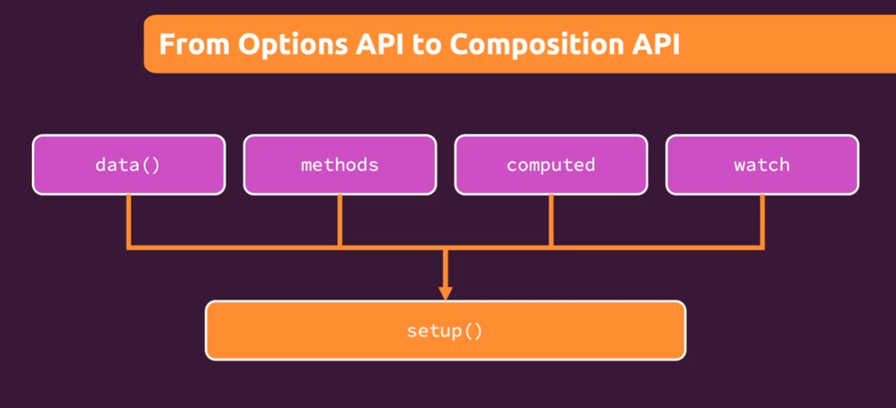

### Composition API

  


#### Reactivity

* `isRef` : 检查某个值是否为 ref

  ```vue
  <script setup>
    function doFetch(){
      // doSomething
    }
    if(isRef(val)) {
      //如果输入的val是一个ref，那么将启动一个响应式的请求
      watchEffect(doFetch) // doFetch为一个方法名
    }
  </script>
  ```

  

* `isReactive` : 检查一个对象是否是由 [`reactive()`](https://cn.vuejs.org/api/reactivity-core.html#reactive) 或 [`shallowReactive()`](https://cn.vuejs.org/api/reactivity-advanced.html#shallowreactive) 创建的代理。

  

* `toRefs` : 将响应对象的**可枚举属性**转换为**单独的响应式数据**。`将对象中的每个属性都做一次ref操作，使每个属性都具有响应式`

  ```vue
  <script setup>
  import { toRefs, reactive } from 'vue'
  
    const data = reactive({
      name: 'guoguo',
      age: '18'
    })
    const dataRef = toRefs(data) //toRefs 使得data中所有属性具有响应式
    const dataRef = ...toRefs(data) // 则失去了响应式  没看懂
  </script>
  ```

  

#### computed

```vue
<script setup>
    import { ref, computed } from 'vue'
    
    const firstName = ref('first')
	const lastName = ref('last')
	const uName = computed(() => {
  		return firstName.value + ' ' + lastName.value
	}) // uName 其实是个 ref
</script>
```


#### watch

```vue
<script setup>
	import { ref, watch } from 'vue'
    
    const age = ref(31)
    
    // 1
    watch(age, function(newValue, oldValue){
        const newAgeValue = newValue
        const oldAgeValue = oldValue
    })
    
    // 2
    watch([ref, computedRef, ...], function(newValues, oldValues){
        const newRefValue = newValues[0]
        const newComputedRefValue = newValues[1]
    })
</script>
```


#### template ref

```vue
<script setup>
	const inputRef = ref(null)   // inputRef.current 可以拿到组件实例
</script>

<template>
	<input ref="inputRef"/>	
</template>
```


#### props

```vue
// 写法一 Options API
<script>
import {computed} from "vue";

export default {
  props: ['firstName', 'lastName'],
  setup(props) {  // setup 只执行一次
    const fullName = computed(() => {  // props值有变化时，会执行computed回调
      return props.firstName + ' ' + props.lastName
    })
    return {fullName}
  }
}
</script>

// 写法二 Composition API
<script setup>
import {computed} from "vue";

// 仅 <script setup> 中可用的编译宏命令
const props = defineProps({
  firstName: String,
  lastName: {
    type: String,
    default: ''
  }
})

const fullName = computed(() => {
  return props.firstName + ' ' + props.lastName
})
</script>
```


#### emits events

```vue
// 写法一 Options API
<script>
export default{
    setup(props, context){
        context.emit('save-data', 1)  // 等价于以前的写法 this.$emit('save-data', 1)
    }
}
</script>

// 写法二 Composition API
<script setup>
const emit = defineEmits({
    'save-data': null   // 没有校验
})

emit('save-data', 1)
</script>
```


#### 事件校验

`emits` 选项还支持对象语法，它允许我们对触发事件的参数进行验证：

```vue
<script setup>
const emit = defineEmits({
  // 没有校验
  inFocus: null,

  // 校验 submit 事件
  submit: ({ email, password }) => {
    if (email && password) return true
    else return false
  }
})

function submitForm(email, password) {
  emit('submit', { email, password })
}
</script>
```

注意：

不论校验是否通过，都会触发 `submit` 事件。

校验不通过时，控制台显示如下 `warning` :

> [Vue warn]: Invalid event arguments: event validation failed for event "submit".


 


